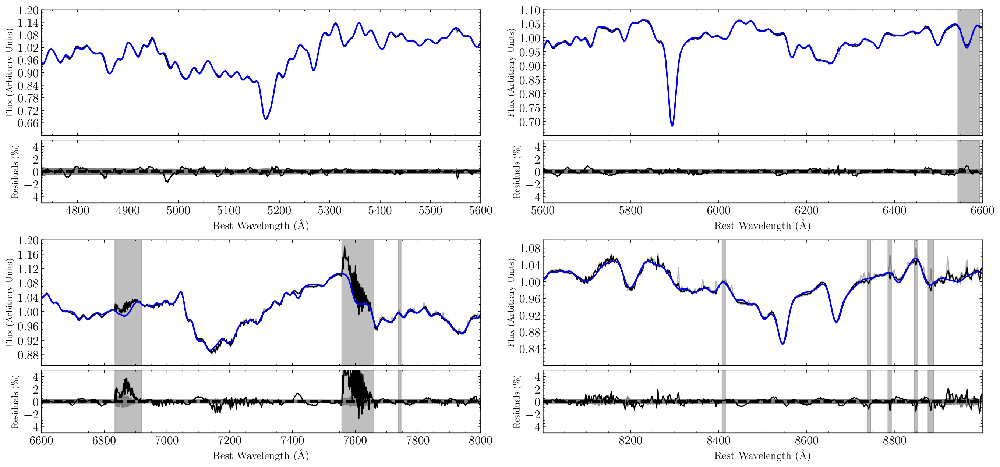

# PyStaff: Stellar Absorption Feature Fitting in python

PyStaff (Python Stellar Absorption Feature Fitting) is a python code to recover stellar population parameters (such as Stellar Age, Metallicity and the Initial Mass Function) from visible and near-IR spectra of nearby galaxies. It's built to work with the newest version of the single stellar population models of Conroy, Villaume, van Dokkum & Lind (described [here](https://ui.adsabs.harvard.edu/#abs/2018ApJ...854..139C/abstract)) which are available on request from Charlie Conroy's [website](https://scholar.harvard.edu/cconroy/sps-models). 

The code has been used in Vaughan et. al 2018b, to measure the stellar population of NGC 1399 using data from MUSE. 

You can read the docs at [pystaff.readthedocs.io](http://pystaff.readthedocs.io/en/latest/index.html)

## Features: 

* Recover the best fit recession velocity and velocity dispersion of the spectrum (with higher order moments to be added in the future)
* Measure stellar population parameters such as Age, [Z/H] and the IMF, as well as abundances of the 18 elements varied within the models
* Subtract a series of sky spectra during the fit, to deal with over/under subtracted night sky emission lines
* Carefully account for a varying instrumental resolution as a function of wavelength
* Simultaneously fit a number of emission lines with the stellar absorption features
* Easily switch on or off which parameters to vary, thanks to the `lmfit` package
* Full sampling of the posterior with `emcee`
* A simple example of use with an MPI pool is given, to allow the code to be used on a cluster

Using the code on a different set of SSP models would be possible but would require a fair amount of work. It's something I'd like to make easier in future!

The code is being actively documented and updated. 

## Acknowledgements

A number of functions are imported from Michele Cappellari's fantastic Penalized Pixel Fitting code (pPXF: more info [here](http://www-astro.physics.ox.ac.uk/~mxc/software/), and available from PyPI). I'd also like to thank Charlie Conroy for making available the latest version of the SSP models. 

## Dependencies

* Python 3
* Standard scientific python stack (numpy, scipy, matplotlib, astropy)
* pPXF- `pip install ppxf`

You can also run `pip install -r requirements.txt`
